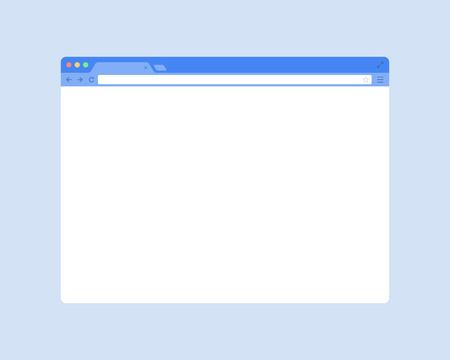

# Aula 01

JavaScript (frequentemente abreviado como JS) é uma linguagem de programação interpretada estruturada, de script em alto nível com tipagem dinâmica fraca e multiparadigma (protótipos, orientado a objeto, imperativo e, funcional). Juntamente com HTML e CSS, o JavaScript é uma das três principais tecnologias da World Wide Web. JavaScript permite páginas da Web interativas e, portanto, é uma parte essencial dos aplicativos da web. A grande maioria dos sites usa, e todos os principais navegadores têm um mecanismo JavaScript dedicado para executá-lo.
fonte:  [wikipedia](https://pt.wikipedia.org/wiki/JavaScript)

## Noções básicas sobre js no frond end
### DOM e BOM
Um script JS tem como objetivo inicial capturar, alterar ou adicionar comportamentos da nossa homepage, entretando o JS vai além, com ele podemos interagir com o Browser dando uma experiência à mais ao usuario, por isso devemos entender o que significa o DOM e o BOM.

#### DOM (Document Object Model)

Primeiramente precisamos relembrar o que é HTML! HyperText Markup Language (Linguagem de marcação de hipertexto) é um conjunto tags que encapsulam dados, quando lido por um browser (ou até mesmo uma pessoa) são organizados para dar sentido há uma informação, vamos ao um exemplo básico.

Imagine que você você trabalha com venda de roupas e acaba chegar um lote de calças jeans azul, vemelha e preta, com os numeros de 36 a 44, modelos masculinos e femininos. Para facilitar seu trabalho o que você faz? Deixa tudo como está assim você evita a fadiga rsrs ou, separa por categoria? Com toda certeza você separar para um lado as masculina e para outro a feminina, para ficar ainda melhor, você separa em caixas por tamanho e coloca uma plaquinha ou etiqueta informando o tamanho. Então você anota em uma agenda a quantidade de cada modelo e cor, para facilitar gerencia da venda dessas peças.... ufa!!! Assim também funciona HTML, ele organiza cada tipo de dado em uma tag (caixa).

E se colocassemos as anotações da agenda em uma tabela HTML?
<table>
    <thead>
        <tr>
            <td>Categoria</td>
            <td>Tamanho</td>
            <td>Cor</td>
            <td>Quantidade</td>
        </tr>
    </thead>
    <tbody>
        <tr>
            <td>Masculina</td>
            <td>40</td>
            <td>Azul</td>
            <td>10</td>
        </tr>
        <tr>
            <td>Feminina</td>
            <td>36</td>
            <td>Preta</td>
            <td>15</td>
        </tr>
    </tbody>
</table>

O que tudo isso tem haver com o DOM? Tudo! na verdade o DOM é o próprio HTML, só que agora em formato de objeto, ou seja, quando o navegador recebe uma página transforma o HTML em uma arvore objetos dando agora vida aquilo que era apenas texto.

#### BOM (Browser Object Model)
O BOM é ainda mais simples que o DOM, ele nada mais é que o a instancia do nagevador, ou seja, se queremos saber o tamanho da tela, colocar em fullscreen, fechar o navegador, todas essas operações são feitos a nível do BOM. No BOM vamos ter tamém o DOM, ou seja, o BOM é o um escope global e o DOM é uma escopco mais específico

### Como acessar o DOM e BOM com JS?
Como eles são objetos para invorcar o BOM `window` para o DOM `document` ou `window.document`

## JS Básico
Agora que já entendemos o conceito básico vamos aos poucos experimentando as ferramentas que a linguagem nos dá.

## variáveis e constantes
